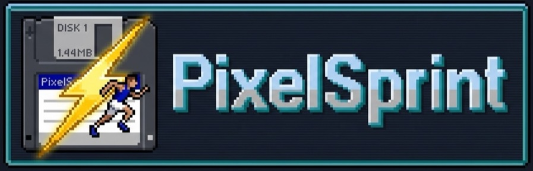
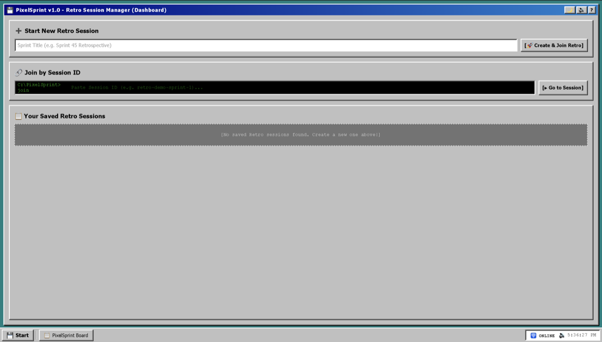
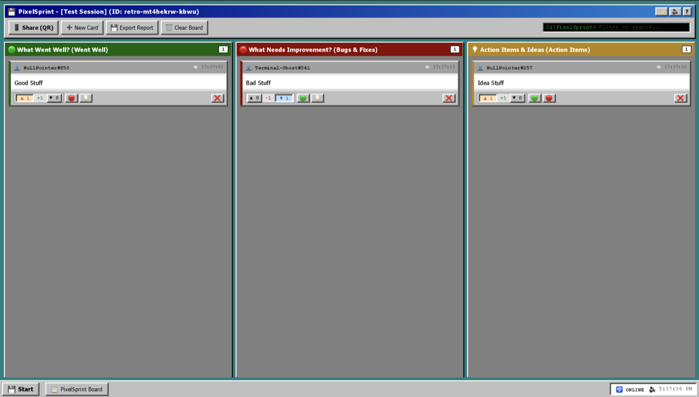
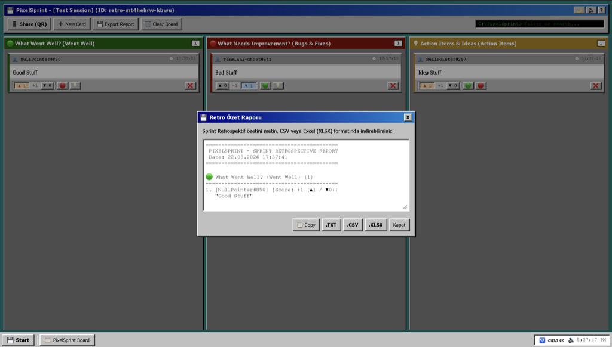

# 💾 PixelSprint

> **100% Anonymous, Mobile-Friendly, Installable (PWA) Sprint Retrospective Board with a 90s Windows 95 & Terminal Aesthetic.**

[](LICENSE)
[](https://www.typescriptlang.org/)
[](https://vitejs.dev/)
[](https://web.dev/progressive-web-apps/)
[](https://github.com/your-org/PixelSprint)

---

## 💻 About PixelSprint

**PixelSprint** is a nostalgic, full-featured retrospective application designed for software development teams conducting Sprint End Retrospectives (Retro). It combines the iconic 90s Windows 95 desktop experience and classic matrix-style green-on-black terminal aesthetics with modern web engineering standards (Vite, TypeScript, Progressive Web App, Workbox).

- **100% Anonymity**: No registration, login, or tracking. Every note automatically receives a randomized retro agent codename (`FloppyDisk-95#404`, `Agent-404#101`, etc.).
- **Real-Time Synchronization**: Instant cross-tab, multi-window, and multi-device real-time sync engine (`BroadcastChannel` & WebSocket adapter) so team members see notes, votes, and category changes live!
- **Offline Mode (`ERR_RETRO_OFFLINE`)**: Runs fully offline with automated Service Worker caching and nostalgic Win95 taskbar offline indicator. Local edits re-sync automatically when connection is restored.
- **Client-Side Storage (`localStorage`)**: All data remains strictly inside the user's browser storage.

---

## 📸 App Screenshots & Previews

|           **Win95 Session Launcher (Dashboard)**            |                **Retro Board & Voting System**                 |
| :---------------------------------------------------------: | :------------------------------------------------------------: |
|  |  |

### 💾 Multi-Format Retro Report Export Modal (.TXT, .CSV, .XLSX)



---

## ⭐ Key Features

### 1. ⚡ Real-Time Multi-Device Synchronization

- Native **`BroadcastChannel` API** engine for instant zero-latency sync across all browser tabs and windows.
- Pluggable WebSocket / P2P adapter support for multi-device server synchronization.

### 2. 🗔 Authentic Windows 95 UI / UX

- Win95 desktop teal background (`#008080`), classic blue titlebars, bevel outset/inset 3D borders.
- Live **Win95 Taskbar** with a functional **Start Menu**, live system clock, and nostalgic **`[⚠️ ERR_RETRO_OFFLINE]`** status badge.
- Built-in retro Web Audio API sound synthesizer with a sound toggle (`🔊`).

### 3. 🚀 Retro Session Manager & Session ID

- **Dashboard Launcher**: Create new retrospective sessions with custom titles (e.g. _Sprint 45 Retrospective_) or view past saved sessions.
- **Session ID & URL Routing**: Every retro session generates a unique Session ID (e.g. `#session=retro-demo-sprint-1`) for instant navigation and bookmarking.

### 4. 📱 QR Code Mobile Participant Sharing

- Click **`Paylaş (QR)`** in the toolbar or Start Menu to generate an instant interactive **QR Code**.
- Meeting participants can scan the QR Code using their smartphone cameras to immediately join the retro session and submit anonymous notes from their phones.

### 5. ⬆️⬇️ Reddit-Style Upvote & Downvote System

- Reddit-style karma score on retro notes with `▲ Upvote` (+1) and `▼ Downvote` (-1) buttons.
- Color-coded live score badges (green for positive score, red for negative score).

### 6. 🟢🔴💡 Retrospective Categories

- **🟢 Went Well**: What went well during the sprint?
- **🔴 Needs Improvement**: Bugs, bottlenecks, and areas for improvement.
- **💡 Action Items**: Actionable tasks and new ideas.

### 7. 💾 Multi-Format Exporting (.TXT, .CSV, .XLSX)

- Export retro summaries as formatted **.TXT** text files, **.CSV** (Excel-compatible UTF-8 BOM), or native **.XLSX** (Excel XML Spreadsheet) files.

---

## 📁 Project Directory Structure

```
PixelSprint/
├── vite.config.ts            # Vite & VitePWA Configuration
├── index.html                # Main HTML Entry Point
├── tsconfig.json             # TypeScript Configuration
├── package.json              # Dependencies and NPM Scripts
├── LICENSE                   # Apache License 2.0
├── SECURITY.md               # Security Policy
├── CODE_OF_CONDUCT.md        # Contributor Covenant Code of Conduct
├── CONTRIBUTING.md           # Contribution Guidelines & Conventional Commits
│
├── .github/
│   ├── dependabot.yml        # Dependabot Configuration
│   └── workflows/
│       ├── deploy.yml        # GitHub Pages Automated Deployment Workflow
│       ├── ci.yml            # Continuous Integration PR Check
│       └── release-please.yml# Automated Versioning & Release Workflow
│
├── public/                   # Static Assets (Favicon, PWA Icons)
│   ├── favicon.png
│   └── icons/
│
└── src/                      # TypeScript & CSS Source Code
    ├── main.ts               # Application Entry Point
    ├── css/                  # Modular CSS Styles (win95, retro-board, responsive)
    ├── types/                # TypeScript Interfaces & Definitions
    ├── core/                 # Store, Sync Engine (BroadcastChannel), Audio Synth, and PWA Installer
    ├── components/           # Dashboard, Board, Modal, Export, Share, and Taskbar
    └── utils/                # Constants and Helper Functions
```

---

## 🛠️ Installation & Local Development

### 1. Clone Repository & Install Dependencies:

```bash
git clone https://github.com/your-org/PixelSprint.git
cd PixelSprint
npm install
```

### 2. Run Local Development Server (HMR):

```bash
npm run dev
```

Open `http://localhost:5173` in your browser.

### 3. Build Production Bundle:

```bash
npm run build
```

The optimized PWA production assets will be generated in `dist/`.

---

## 📜 License

Distributed under the **[Apache License 2.0](LICENSE)**.
